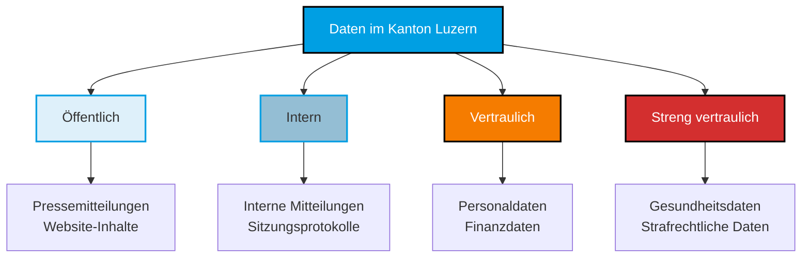
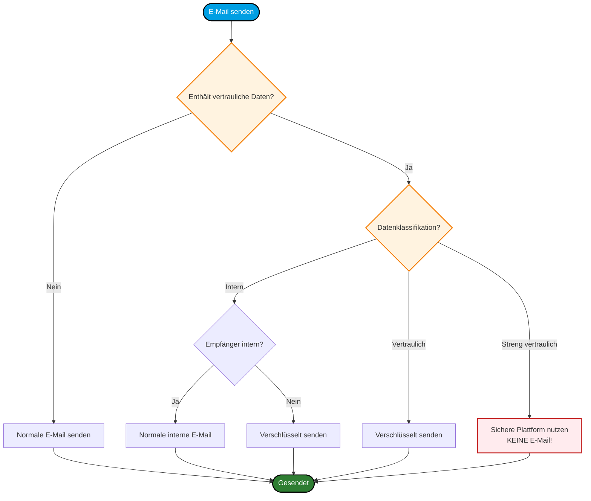
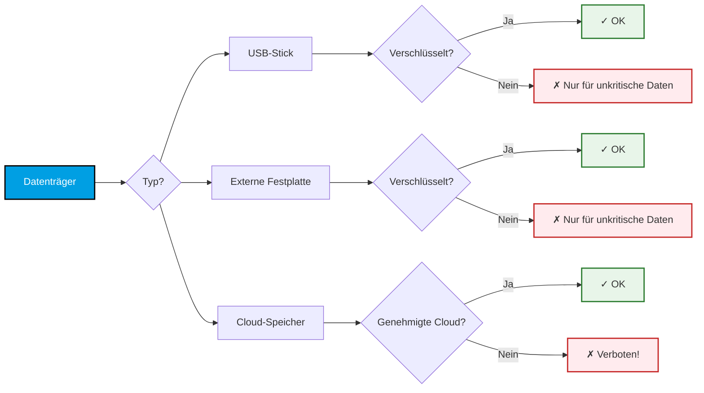
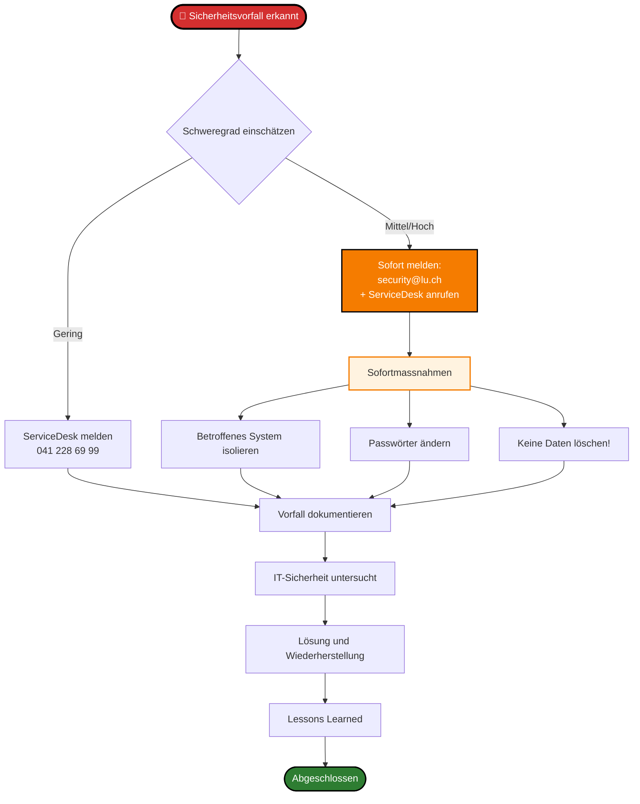
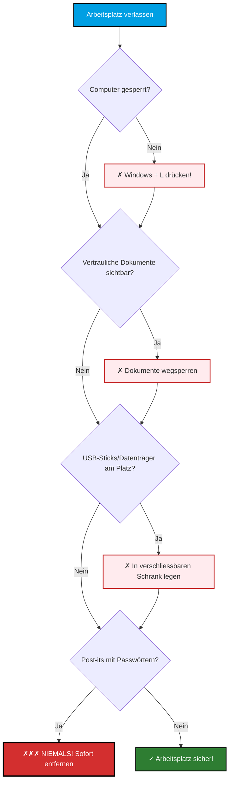

# IT-Sicherheit und Datenschutz

Schulung für Mitarbeitende 2026

---
layout: default
---

# Agenda

1. **E-Mail-Sicherheit** - Phishing erkennen und vermeiden
2. **Datenschutz-Grundlagen** - DSGVO und kantonale Vorgaben
3. **Prozesse und Workflows** - Sichere Arbeitsabläufe
4. **Incident Response** - Was tun bei Sicherheitsvorfällen?
5. **Best Practices** - Tipps für den Alltag

---
layout: section
---

# E-Mail-Sicherheit

## Phishing erkennen und vermeiden

---
layout: default
---

# Beispiel: Verdächtige E-Mail

  

    
<strong>Von:</strong> support@kantoon-luzern.ch

    
<strong>An:</strong> mitarbeiter@lu.ch

    
<strong>Betreff:</strong> DRINGEND: Passwort zurücksetzen erforderlich!

    
<strong>Datum:</strong> 27. Januar 2026, 23:47

  

  

    
Sehr geehrte/r Mitarbeiter/in,

    
Aus Sicherheitsgründen müssen Sie Ihr Passwort sofort zurücksetzen. Ihr Konto wird in 24 Stunden gesperrt!

    
<a href="#" class="suspicious-link">Klicken Sie hier zum Zurücksetzen →</a>

    
IT-Abteilung Kanton Luzern

  

---
layout: default
---

# Warnsignale erkennen

  
⚠️

  

    <h3>Typische Phishing-Merkmale</h3>
    <ul>
      <li><strong>Falsche Absenderadresse:</strong> "kantoon" statt "kanton"</li>
      <li><strong>Zeitdruck:</strong> "DRINGEND", "in 24 Stunden"</li>
      <li><strong>Verdächtige Links:</strong> Nie direkt auf Links klicken!</li>
      <li><strong>Späte Uhrzeit:</strong> 23:47 Uhr - ungewöhnlich</li>
      <li><strong>Unpersönliche Anrede:</strong> Kein Name genannt</li>
    </ul>
  

  
✅

  

    <h3>Richtig reagieren</h3>
    
<strong>Nicht antworten, nicht klicken!</strong> Melden Sie verdächtige E-Mails sofort an: <strong>security@lu.ch</strong>

  

---
layout: section
---

# Datenschutz-Grundlagen

## DSGVO und kantonale Vorgaben

---
layout: default
---

# Datenklassifikation

---
layout: two-cols
---

::left::

## Öffentlich & Intern

  
📄

  

    <h4>Öffentlich</h4>
    
Keine besonderen Schutzmassnahmen

  

  
🏢

  

    <h4>Intern</h4>
    
Nur für Mitarbeitende

    <ul>
      <li>Passwortschutz</li>
      <li>Keine externe Weitergabe</li>
    </ul>
  

::right::

## Vertraulich & Streng vertraulich

  
🔒

  

    <h4>Vertraulich</h4>
    <ul>
      <li>Verschlüsselung erforderlich</li>
      <li>Need-to-know Prinzip</li>
      <li>Zugriffsprotokollierung</li>
    </ul>
  

  
🔐

  

    <h4>Streng vertraulich</h4>
    <ul>
      <li>Höchste Schutzstufe</li>
      <li>Spezielle Genehmigung</li>
      <li>Separate Systeme</li>
    </ul>
  

---
layout: section
---

# Prozesse und Workflows

## Sichere Arbeitsabläufe

---
layout: default
---

# E-Mail-Verschlüsselung: Wann und wie?

---
layout: default
---

# Passwort-Richtlinien

  
🔑

  

    <h3>Sichere Passwörter erstellen</h3>
    <ul>
      <li><strong>Mindestens 12 Zeichen</strong> (besser 16+)</li>
      <li><strong>Kombination:</strong> Gross-/Kleinbuchstaben, Zahlen, Sonderzeichen</li>
      <li><strong>Keine persönlichen Daten</strong> (Namen, Geburtsdaten, etc.)</li>
      <li><strong>Keine Wörter aus dem Wörterbuch</strong></li>
      <li><strong>Passphrasen nutzen:</strong> "Blau€Baum!Kaffee#2026"</li>
    </ul>
  

## Passwort-Manager nutzen

✅ **Empfohlen:** KeePass, 1Password, Bitwarden  
✅ **Vorteil:** Ein Masterpasswort merken, alle anderen sicher gespeichert  
✅ **Kanton-Lösung:** Kontaktieren Sie die Dienststelle Informatik

---
layout: default
---

# Umgang mit Datenträgern

  
⚠️

  

    
<strong>Wichtig:</strong> Private Cloud-Dienste (Dropbox, Google Drive, etc.) dürfen NICHT für kantonale Daten verwendet werden!

  

---
layout: section
---

# Incident Response

## Was tun bei Sicherheitsvorfällen?

---
layout: default
---

# Incident Response Prozess

---
layout: default
---

# Beispiele für Sicherheitsvorfälle

  
🚨

  

    <h3>Kritisch - Sofort melden!</h3>
    <ul>
      <li>Ransomware-Angriff / Verschlüsselung von Daten</li>
      <li>Gestohlener/verlorener Laptop mit sensiblen Daten</li>
      <li>Unbefugter Zugriff auf System erkannt</li>
      <li>Datenleck nach aussen</li>
    </ul>
  

  
⚠️

  

    <h3>Mittel - Zeitnah melden</h3>
    <ul>
      <li>Verdächtige E-Mail geklickt</li>
      <li>Unsichere Website besucht</li>
      <li>Verdächtiges Verhalten am PC</li>
      <li>Unbekannte Software installiert</li>
    </ul>
  

---
layout: two-cols
---

::left::

## ✅ DO - Richtig handeln

- **Ruhe bewahren**
- **Sofort melden**
- **System isolieren** (Netzwerk trennen)
- **Screenshots machen** (Beweise sichern)
- **Passwörter ändern** (andere Geräte)
- **IT-Anweisungen folgen**
- **Dokumentieren** (Was, Wann, Wie)

::right::

## ❌ DON'T - Vermeiden

- **Nicht in Panik geraten**
- **Nichts löschen!** (Beweise)
- **Nicht selbst "reparieren"**
- **Nicht ignorieren**
- **Nicht warten** ("Vielleicht geht's weg")
- **Niemandem die Schuld geben**
- **Nicht verschweigen** (keine Angst!)

---
layout: section
---

# Best Practices

## Tipps für den sicheren Alltag

---
layout: default
---

# Checkliste: Tägliche IT-Sicherheit

  
📋

  

    <h3>Jeden Tag</h3>
    <ul>
      <li>✅ Bildschirm sperren beim Verlassen (Windows + L)</li>
      <li>✅ E-Mails kritisch prüfen (Absender, Links, Anhänge)</li>
      <li>✅ Nur genehmigte Software nutzen</li>
      <li>✅ Updates installieren (wenn aufgefordert)</li>
    </ul>
  

  
📅

  

    <h3>Regelmässig</h3>
    <ul>
      <li>✅ Passwörter alle 90 Tage ändern</li>
      <li>✅ Nicht benötigte Daten löschen</li>
      <li>✅ Zugriffsrechte prüfen</li>
      <li>✅ Schulungen besuchen</li>
    </ul>
  

---
layout: default
---

# Clean Desk Policy

---
layout: default
---

# Kontakte und Ressourcen

  
📞

  

    <h3>Dienststelle Informatik</h3>
    
<strong>ServiceDesk:</strong> 041 228 69 99 | servicedesk@lu.ch

    
<strong>IT-Sicherheit:</strong> security@lu.ch

    
<strong>Montag bis Freitag:</strong> 07:00 - 12:00, 13:00 - 17:30

  

  
🌐

  

    <h3>Intranet-Ressourcen</h3>
    
<strong>IT-Sicherheitsrichtlinien:</strong> intranet.lu.ch/sicherheit

    
<strong>Schulungsunterlagen:</strong> intranet.lu.ch/schulungen

    
<strong>FAQ:</strong> intranet.lu.ch/it-faq

  

---
layout: default
---

# Zusammenfassung

## Die wichtigsten Punkte

✅ **E-Mail-Sicherheit:** Phishing erkennen, Links prüfen, bei Verdacht melden

✅ **Datenschutz:** Datenklassifikation beachten, vertrauliche Daten schützen

✅ **Starke Passwörter:** Mindestens 12 Zeichen, Passwort-Manager nutzen

✅ **Clean Desk:** Bildschirm sperren, Dokumente wegsperren

✅ **Im Zweifel:** Lieber einmal zu viel melden als zu wenig!

  
💡

  

    
<strong>Denken Sie daran:</strong> IT-Sicherheit ist Teamarbeit. Jede/r trägt Verantwortung!

  

---
layout: end
---

# Vielen Dank!

## Fragen und Diskussion

**Kontakt:**  
Thomas Weber  
Dienststelle Informatik  
thomas.weber@lu.ch  
Tel. 041 228 50 00

**ServiceDesk:** 041 228 69 99